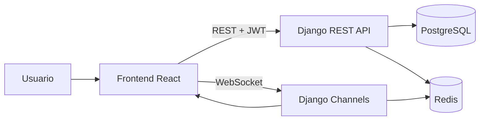

# Task Manager Esmerald

Aplicación colaborativa de gestión de tareas tipo **Kanban** con colaboración en tiempo real.

[](#stack-tecnológico)
[](#stack-tecnológico)
[](#arquitectura)
[](./LICENSE)

---

## Tabla de contenidos

- [Estado del proyecto](#estado-del-proyecto)
- [Visión general](#visión-general)
- [Arquitectura](#arquitectura)
- [Stack tecnológico](#stack-tecnológico)
- [Estructura del repositorio](#estructura-del-repositorio)
- [Requisitos previos](#requisitos-previos)
- [Configuración de entorno](#configuración-de-entorno)
- [Instalación y ejecución local](#instalación-y-ejecución-local)
- [Testing](#testing)
- [Scripts útiles](#scripts-útiles)
- [API y módulos principales](#api-y-módulos-principales)
- [Guía de contribución](#guía-de-contribución)
- [Buenas prácticas de Code Review](#buenas-prácticas-de-code-review)
- [Roadmap técnico sugerido](#roadmap-técnico-sugerido)
- [Licencia](#licencia)

---

## Estado del proyecto

**Versión actual:** `v1.0.0`

Este release representa una base funcional estable del producto. El proyecto seguirá evolucionando de forma incremental con nuevas funcionalidades, mejoras de UX/UI, optimizaciones de rendimiento y ampliación de cobertura de pruebas.

> Si estás evaluando contribuir: esta versión está pensada como punto de partida sólido para escalar el roadmap.

---

## Visión general

Task Manager Esmerald permite gestionar tableros, columnas y tarjetas, con funcionalidades de colaboración entre miembros del equipo y sincronización en tiempo real.

### Objetivos del proyecto

- Mejorar la productividad del equipo con un flujo visual de trabajo.
- Permitir colaboración multiusuario con control de roles.
- Mantener una base escalable con separación clara entre frontend y backend.

---

## Arquitectura

El sistema sigue una arquitectura desacoplada:

- **Frontend SPA** en React/TypeScript.
- **API REST** para operaciones transaccionales.
- **WebSockets** para eventos en tiempo real (tableros/chat).
- **PostgreSQL** como almacenamiento principal.
- **Redis** para cache y capa de canales.

### Flujo simplificado



---

## Stack tecnológico

### Frontend

- React 18
- TypeScript
- Vite
- TanStack Query
- Zustand
- React Router

### Backend

- Django
- Django REST Framework
- Django Channels
- SimpleJWT
- Pytest + Pytest-Django

### Infraestructura

- PostgreSQL 15
- Redis 7
- Docker / Docker Compose

---

## Estructura del repositorio

```text
.
├── backend/
│   ├── boards/
│   ├── chat/
│   ├── core/
│   └── config/
├── frontend-collaborativa/
│   └── src/
│       ├── app/
│       ├── api/
│       ├── core/
│       ├── features/
│       └── shared/
├── docker-compose.yml
├── Dockerfile
└── README.md
```

---

## Requisitos previos

- Docker + Docker Compose
- Node.js 20+
- npm 10+
- Python 3.12+ (solo si ejecutarás backend fuera de Docker)

---

## Configuración de entorno

Crea `backend/.env` con valores mínimos para desarrollo:

```env
SECRET_KEY=changeme
DEBUG=True
ALLOWED_HOSTS=localhost,127.0.0.1
DATABASE_URL=postgres://postgres:postgres@db:5432/task_manager
DB_NAME=task_manager
DB_USER=postgres
DB_PASSWORD=postgres
REDIS_URL=redis://redis:6379/0
CORS_ALLOWED_ORIGINS=http://localhost:5173,http://127.0.0.1:5173
```

> Recomendación: no commitear secretos reales. Usa un gestor de secretos en staging/producción.

---

## Instalación y ejecución local

### Opción recomendada (backend + db + redis con Docker)

```bash
docker compose up --build
```

Servicios esperados:

- Backend: `http://localhost:8000`
- Health check: `GET /`

### Frontend local

```bash
cd frontend-collaborativa
npm install
npm run dev
```

Frontend disponible en `http://localhost:5173`.

---

## Testing

### Backend

```bash
cd backend
pip install -r requirements.txt
pytest
```

### Frontend

```bash
cd frontend-collaborativa
npm install
npm run test
```

---

## Scripts útiles

### Frontend (`frontend-collaborativa/package.json`)

- `npm run dev` → entorno local
- `npm run build` → compilación de producción
- `npm run lint` → análisis estático
- `npm run test` → pruebas unitarias

### Backend

- `pytest` → pruebas backend
- `python manage.py migrate` → migraciones
- `python manage.py createsuperuser` → usuario admin

---

## API y módulos principales

Rutas base:

- `api/auth/` autenticación (`login`, `register`)
- `api/users/` gestión y búsqueda de usuarios
- `api/boards/` tableros, columnas, tarjetas y miembros
- `api/chat/` mensajería por tablero

Health check:

- `/` retorna estado de la API

---

## Guía de contribución

¡Contribuciones bienvenidas!

### Flujo de ramas recomendado (GitFlow simplificado)

- `main`: producción
- `develop`: integración
- `feature/*`: nuevas funcionalidades
- `release/*`: preparación de release
- `hotfix/*`: correcciones urgentes

### Estándar de commits

Se recomienda **Conventional Commits**:

- `feat:` nueva funcionalidad
- `fix:` corrección de bug
- `refactor:` mejoras internas sin cambio funcional
- `test:` pruebas
- `docs:` documentación
- `chore:` mantenimiento

Ejemplo:

```bash
git commit -m "feat(boards): add board member invitation flow"
```

### Proceso de Pull Request

1. Crea una rama desde `develop`.
2. Implementa y prueba el cambio.
3. Actualiza documentación si aplica.
4. Abre PR con contexto funcional/técnico claro.
5. Espera aprobación de Code Review antes de merge.

---

## Buenas prácticas de Code Review

Checklist sugerido antes de merge a producción:

- [ ] Cumple principios SOLID, DRY y KISS.
- [ ] No hay secretos hardcodeados.
- [ ] Manejo de errores y permisos validado.
- [ ] Cobertura de pruebas actualizada.
- [ ] Sin regresiones de performance (N+1, consultas redundantes).
- [ ] Lint/tests/build en verde.
- [ ] Documentación actualizada (README/Swagger/changelog si aplica).

---

## Roadmap técnico sugerido

- Unificar estrategia de dependencias backend (fuente única de verdad).
- Reforzar CI/CD con quality gates obligatorios.
- Ampliar pruebas de integración para flujos críticos colaborativos.
- Mejorar observabilidad (request-id, métricas, logs estructurados).

---

## Licencia

Este proyecto está licenciado bajo la **MIT License**.

Consulta el archivo [LICENSE](./LICENSE) para más información.
